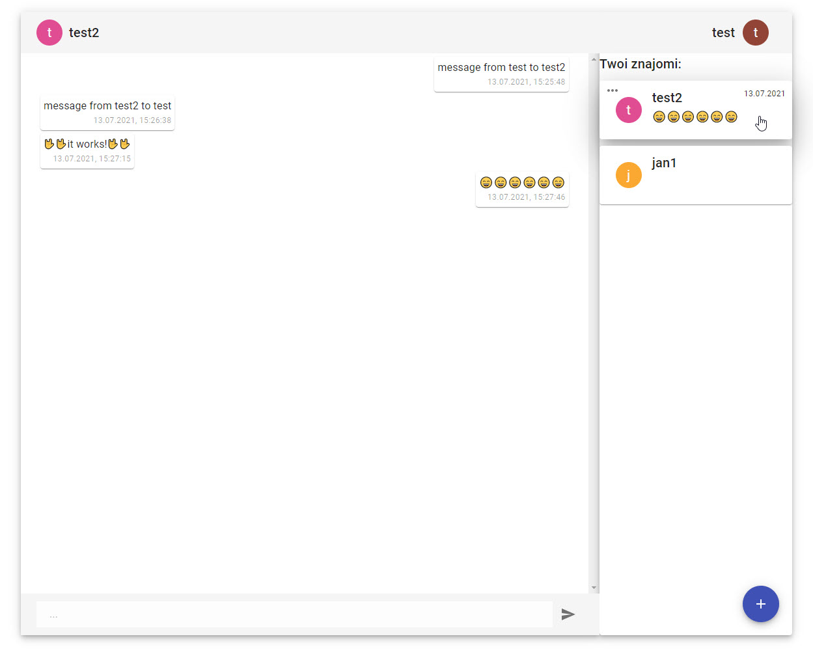
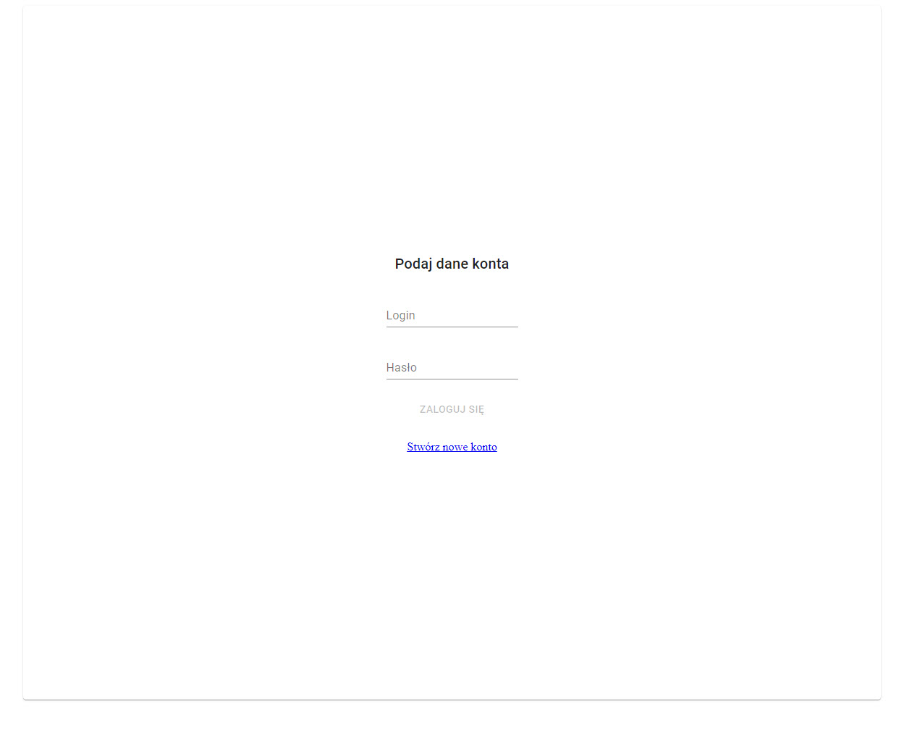
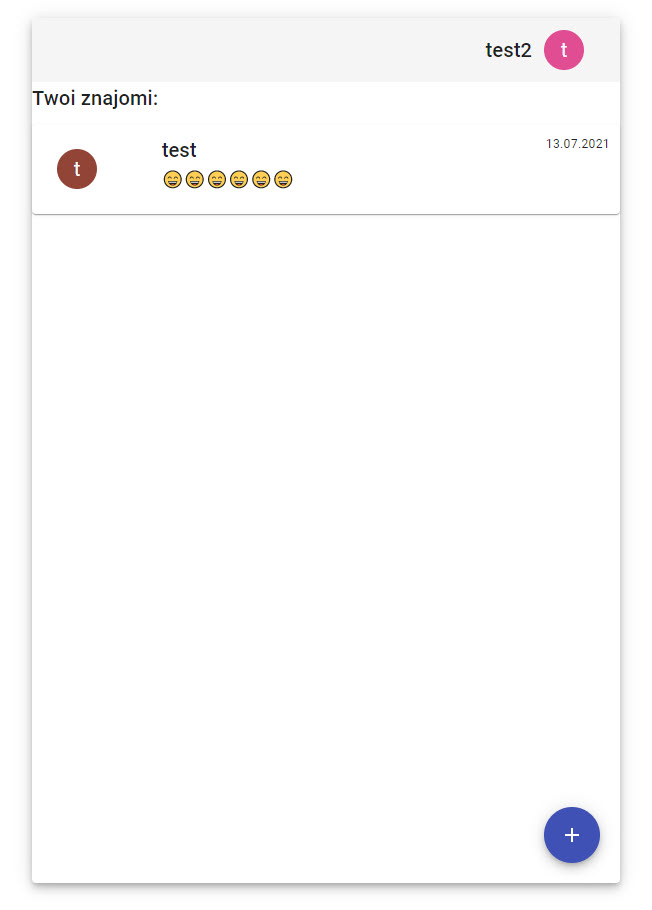
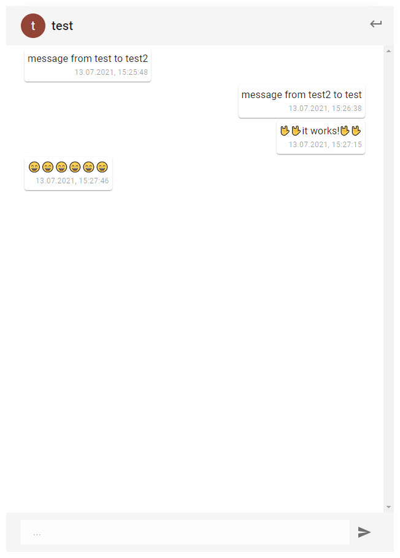

# Simple Web Communicator &middot; 

Simple text communicator app with accounts and friends system, made in 72h.  
App is using http polling as main source of receiving data.

### Wide Screen

### Mobile

## Developing

### Built With
Java 16

Spring (Boot, Security, Data JPA)

React with Material UI

## Licensing

licensed under the

GNU General Public License v3.0